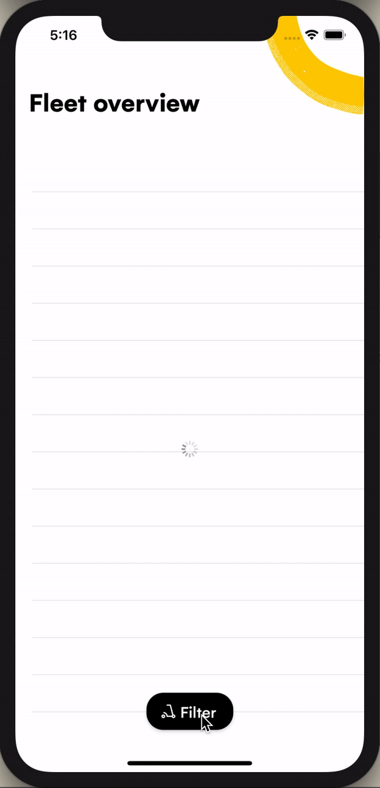

## Tasks

Here are the user stories to implement:
 
### As a user:

1. I want to see the list of vehicles.

2. I want to be able to filter the vehicles by color.

3. I want the vehicle's color filter to be persisted between launches.

4. I want to know if the vehicle's list is filtered.

5. I want to see the vehicle's identification code and QR when I click on one.

6. I want to know when an error preventing me from seeing the list of vehicles has occured.

The end results should look as follows:



- Configured XCode project.

- All of the UI components, layouts, and styling needed to achieve the above design.

- A framework (`AssignmentUtility.xcframework`) containing a class function that handles fetching the raw vehicles data:
```swift
/**
 Request the raw vehicles data.
    
 - This request simulates a server streaming RPC that sends raw vehicles data.
 - New raw vehicles data will be sent at a random interval between 1 to 20 seconds.
 - There's a 30% chance an error will be sent instead of the raw vehicles data.
     
 - Returns: The raw vehicles data.
 # Reference:
 [Server streaming gRPC](https://grpc.io/docs/what-is-grpc/core-concepts/#server-streaming-rpc)
*/
public static func requestVehiclesData() -> RxSwift.Observable<Data>
```
